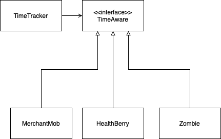

# FIT2099 Assignment (Semester 1, 2025)

```
`7MM"""YMM  `7MMF'      `7MM"""Yb. `7MM"""YMM  `7MN.   `7MF'    MMP""MM""YMM `7MMF'  `7MMF'`7MMF'`7MN.   `7MF' .g8"""bgd  
  MM    `7    MM          MM    `Yb. MM    `7    MMN.    M      P'   MM   `7   MM      MM    MM    MMN.    M .dP'     `M  
  MM   d      MM          MM     `Mb MM   d      M YMb   M           MM        MM      MM    MM    M YMb   M dM'       `  
  MMmmMM      MM          MM      MM MMmmMM      M  `MN. M           MM        MMmmmmmmMM    MM    M  `MN. M MM           
  MM   Y  ,   MM      ,   MM     ,MP MM   Y  ,   M   `MM.M           MM        MM      MM    MM    M   `MM.M MM.    `7MMF'
  MM     ,M   MM     ,M   MM    ,dP' MM     ,M   M     YMM           MM        MM      MM    MM    M     YMM `Mb.     MM  
.JMMmmmmMMM .JMMmmmmMMM .JMMmmmdP' .JMMmmmmMMM .JML.    YM         .JMML.    .JMML.  .JMML..JMML..JML.    YM   `"bmmmdPY  
```

## Contribution Log
[Click here to view our team’s contribution log](https://docs.google.com/spreadsheets/d/15pBS-c5y_sP5OufPUacZMtytC-JItUy2VWfKs9Dc9F0/edit?usp=sharing)

## Important Note:
- ahak0006 forgot to update his Git Account when pushing which caused his commits to be attributed to his personal account which is A.I.Hunter


# REQ 3: Day/Night System

## Overview
This feature introduces a **dynamic Day/Night system** that changes gameplay behavior and world events. The system is controlled by a `TimeTracker`, which alternates between **DAY** and **NIGHT** as the game progresses.

---

## General Mechanics

- At the start of the game, `TimeTracker` is initialized to **DAY**.
- Time automatically advances during gameplay, toggling between **DAY** and **NIGHT**.
- Specific entities and world events are dependent on the current time of day.

---

## NIGHT Events

- **MerchantMob Appears**
    - Spawns on the map offering items at **discounted prices**.
    - Has a **50% chance to scam** the player and **run away** after the interaction.

- **Buff Berry Spawns**
    - A magical **Buff berry grows** on blessed ground randomly.
    - Can be picked up by the player.
    - When consumed **it increases the damage multiplier for farmer's intrinsic weapon by 2.5**.
    - When consumed **it heals the farmer by 10 HP**.

- **Zombies Emerge**
    - **Aggressive zombies rise** from cursed ground and begin **wandering the map**.
    - They pose a threat to the farmer at night.

---

## DAY Events

- **MerchantMob Disappears**
    - The night merchant leaves the map at dawn.

- **Buff Berry**
    - Any uncollected night-time Buff Berry is **removed** from the map.
    - Stays in the inventory if collected

- **Zombies Decay**
    - Zombies that spawned during the night begin to **lose HP every turn**.
    - They **die off naturally** as time progresses through the day.

---




# REQ 4: LLM-Powered NPC Dialogue System (API Integration)

## Overview
This feature introduces **dynamic conversations** with three unique NPCs (**Shabiri**, **The Narrator**, and **The Explorer**) using an **LLM API**. The API returns JSON-formatted dialogue responses based on player interaction.

---

## General Mechanics

- An `LLMService` API is integrated into the game, responsible for generating JSON conversations.
- Conversations are contextual and interactive, changing based on the **player's dialogue choices** or **questions**.
- After a full conversation is complete, approaching the NPC again triggers a **new session** with different content.
- JSON output follows a structured dialogue tree for consistency.

---

## NPC 1: Shabiri (Dynamic Conversation)

- Shabiri enjoys deep, evolving conversations.
- When approached:
    - **Player sees 3 dialogue options** to initiate conversation.
    - Shabiri replies differently based on the selected option.
    - The cycle repeats for **a maximum of 3 exchanges per side** (Farmer ↔ Shabiri).
    - After the final exchange, the conversation ends and will regenerate next time the farmer visits.

---

## NPC 2: The Narrator (Interactive Storyteller)

- A mystical storyteller who shares **short stories in 3 parts**.
- When approached:
    - Narrator begins with **Part 1** of a randomly generated story.
    - Player can choose to **continue listening** to Part 2 and Part 3.
    - When the full story is told, no further stories are available until reapproached.
    - The next visit starts a new, unique 3-part tale.

---

## NPC 3: The Explorer (Lore Guide)

- An old wanderer with knowledge of the game world’s lore.
- When approached:
    - The player can **type a custom question**.
    - The `LLMService` will respond with a **lore-accurate answer** in JSON format.
    - The Explorer can be asked again without limit.

---

## JSON Sample Format (for each NPC)

```json
{
  "npc": "Shabiri",
  "conversation": [
    {
      "playerOptions": ["Option A", "Option B", "Option C"],
      "npcResponses": {
        "Option A": "Response A",
        "Option B": "Response B",
        "Option C": "Response C"
      }
    },
    ...
  ]
}
```


Approved by TA